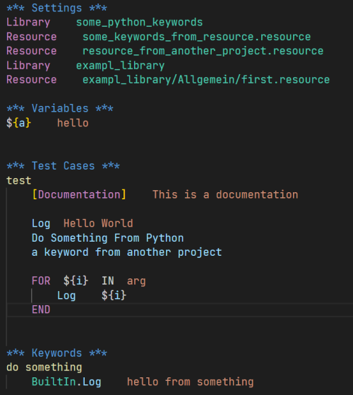
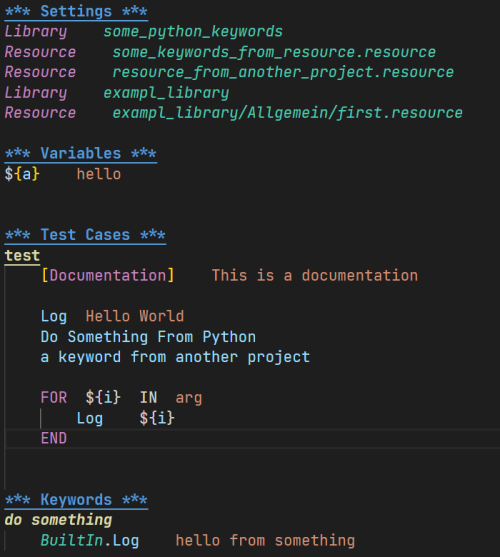

# RobotCode

An [extension](https://marketplace.visualstudio.com/VSCode) which brings support for [RobotFramework](https://robotframework.org/) to [Visual Studio Code](https://code.visualstudio.com/), including features like IntelliSense, linting, debugging, code navigation, code formatting, test explorer, find references for keywords and variables, and more!

## Requirements

* Python 3.8 or above
* Robotframework 4.0 and above
* VSCode version 1.61 and above

## Installed extensions

RobotCode will automatically install [Python extension](https://marketplace.visualstudio.com/items?itemName=ms-python.python).

Extensions installed through the marketplace are subject to the [Marketplace Terms of Use](https://cdn.vsassets.io/v/M146_20190123.39/_content/Microsoft-Visual-Studio-Marketplace-Terms-of-Use.pdf).

## Features

With RobotCode you can edit your code with auto-completion, code navigation, syntax checking and more.

### Autocomplete and IntelliSense

- Library with parameters
- Resources, Variables
- Keywords with parameters


- Variables
  - local variables
  - variables from resource files
  - variables from variables file (.py and .yaml)
  - command line variables
  - builtin variables


### Linting

RobotCode analyse your code for missing libraries, keywords, duplicate imports and many more.
Get addition code analysis with [Robocop](https://robocop.readthedocs.io/). Just install it in your python environment.

### Code Formatting

RobotCode can format your code with the internal RobotFramework robot.tidy tool (deprecated), but also with [Robotidy](https://robotidy.readthedocs.io/). Just install it.

### Running and Debugging

RobotCode supports running and debugging of RobotFramework testcases and tasks out of the box, directly from the definition of the test or suite.


In the debug console you can see all log messages of the current run and navigate to the keyword the message was written by.

TODO

## Quick start

1. [Install a supported version of Python on your system](https://code.visualstudio.com/docs/python/python-tutorial#_prerequisites)
(note: only Python 3.8 and above are supported)

2. [Install a supported version of RobotFramwork on your system](https://github.com/robotframework/robotframework/blob/master/INSTALL.rst) (note: only RobotFramework 4.0 and above are supported)

3. [Install the # RobotCode extension for Visual Studio Code](https://code.visualstudio.com/docs/editor/extension-gallery).
4. Open or create a robot file and start coding! 😉


## Setting up your environment

You can alway use your local python environment, just select the correct python interpreter in Visual Studio Code.

### With pipenv

This is the simpliest way to create an running environment.

- As a prerequisite you need to install [pipenv](https://pipenv.pypa.io/) like this:

    ```bash
    python -m pip install pipenv
    ```


- Create your project directory (robottest is just an example)
    ```bash
    mkdir robottest
    cd robottest
    ```
- Install robotframework
    ```bash
    python -m pipenv install robotframework
    ```
- Open project in VSCode
- Set the python interpreter to the created virtual environment


## Customization

### Editor Style

You can change some stylings for RobotFramework files in VSCode editor (see [Customizing a Color Theme](https://code.visualstudio.com/docs/getstarted/themes#_customizing-a-color-theme))

See the difference:

| before                                                                       | after                                                             |
| ---------------------------------------------------------------------------- | ----------------------------------------------------------------- |
|  |  |


As a template you can put the following code to your user settings of VSCode.

Open the user `settings.json` like this:

<kbd>Ctrl</kbd> + <kbd>Shift</kbd> + <kbd>P</kbd> or <kbd>F1</kbd> or <kbd>CMD</kbd> + <kbd>Shift</kbd> + <kbd>P</kbd>

and then type:

`Preferences: Open Settings (JSON)`

put this to the `settings.json`

```json
"editor.tokenColorCustomizations": {
    "textMateRules": [
        {
            "scope": "variable.function.keyword-call.inner.robotframework",
            "settings": {
                "fontStyle": "italic"
            }
        },
        {
            "scope": "variable.function.keyword-call.robotframework",
            "settings": {
                //"fontStyle": "bold"
            }
        },
        {
            "scope": "entity.name.function.testcase.name.robotframework",
            "settings": {
                "fontStyle": "bold underline"
            }
        },
        {
            "scope": "entity.name.function.keyword.name.robotframework",
            "settings": {
                "fontStyle": "bold italic"
            }
        },
        {
            "scope": "variable.other.readwrite.robotframework",
            "settings": {
                //"fontStyle": "italic",
            }
        },
        {
            "scope": "keyword.control.import.robotframework",
            "settings": {
                "fontStyle": "italic"
            }
        },
        {
            "scope": "keyword.other.header.setting.robotframework",
            "settings": {
                "fontStyle": "bold underline"
            }
        },
        {
            "scope": "keyword.other.header.variable.robotframework",
            "settings": {
                "fontStyle": "bold underline"
            }
        },
        {
            "scope": "keyword.other.header.testcase.robotframework",
            "settings": {
                "fontStyle": "bold underline"
            }
        },
        {
            "scope": "keyword.other.header.keyword.robotframework",
            "settings": {
                "fontStyle": "bold underline"
            }
        },
        {
            "scope": "keyword.other.header.setting.robotframework",
            "settings": {
                "fontStyle": "bold underline"
            }
        },
        {
            "scope": "keyword.other.header.comment.robotframework",
            "settings": {
                "fontStyle": "bold italic underline"
            }
        },
        {
            "scope": "constant.character.escape.robotframework",
            "settings": {
                //"foreground": "#FF0000",
            }
        }
    ]
}
```