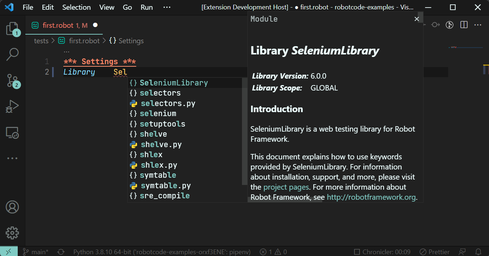
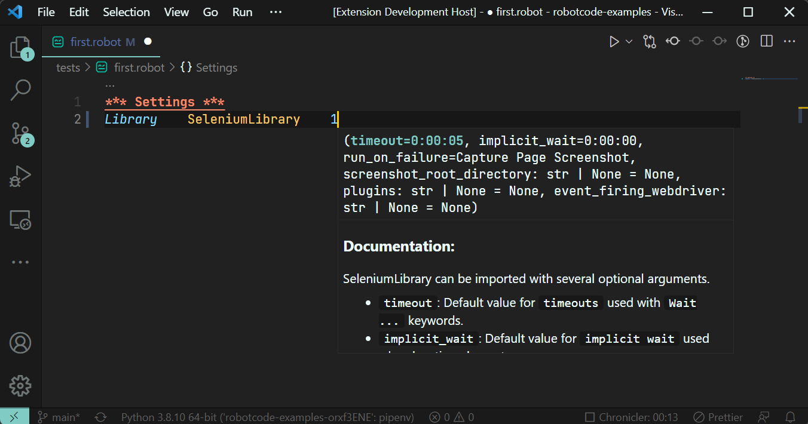
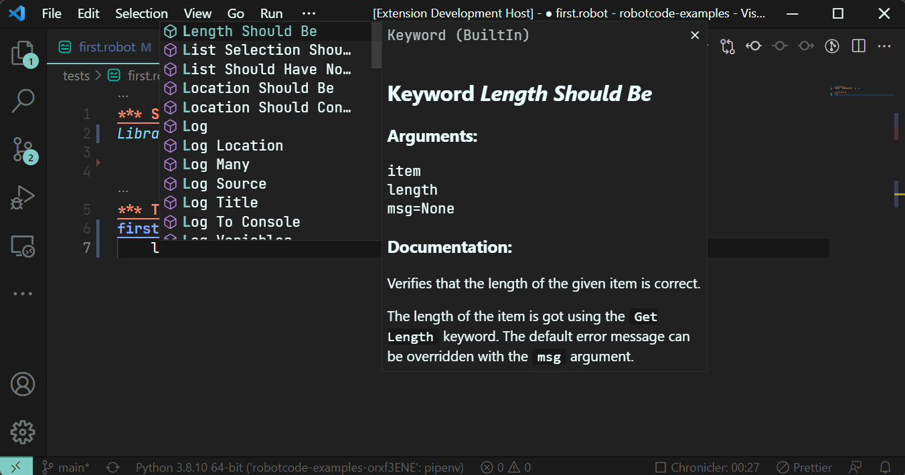
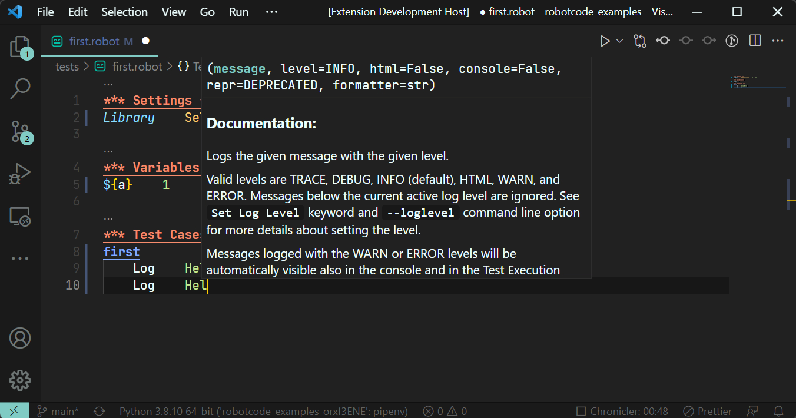

# RobotCode

An [extension](https://marketplace.visualstudio.com/VSCode) which brings support for [RobotFramework](https://robotframework.org/) to [Visual Studio Code](https://code.visualstudio.com/), including features like IntelliSense, linting, debugging, code navigation, code formatting, test explorer, find references for keywords and variables, and more!

## Requirements

* Python 3.8 or above
* Robotframework 4.0 and above
* VSCode version 1.61 and above

## Installed extensions

RobotCode will automatically install [Python extension](https://marketplace.visualstudio.com/items?itemName=ms-python.python).

Extensions installed through the marketplace are subject to the [Marketplace Terms of Use](https://cdn.vsassets.io/v/M146_20190123.39/_content/Microsoft-Visual-Studio-Marketplace-Terms-of-Use.pdf).

## Features

### Autocomplete and IntelliSense

- Library and Resources 


- Library Parameters


- Keywords


- Keyword Parameters


TODO

## Quick start

1. [Install a supported version of Python on your system](https://code.visualstudio.com/docs/python/python-tutorial#_prerequisites) 
(note: only Python 3.8 and above are supported)

2. [Install a supported version of RobotFramwork on your system](https://github.com/robotframework/robotframework/blob/master/INSTALL.rst) (note: only RobotFramework 4.0 and above are supported)

3. [Install the # RobotCode extension for Visual Studio Code](https://code.visualstudio.com/docs/editor/extension-gallery).
4. Open or create a robot file and start coding! 😉


## Setting up your environment

You can alway use your local python environment, just select the correct python interpreter in Visual Studio Code.

### With pipenv

This is the simpliest way to create an running environment.

- As a prerequisite you need to install [pipenv](https://pipenv.pypa.io/) like this:

    ```bash
    python -m pip install pipenv   
    ```


- Create your project directory (robottest is just an example)
    ```bash
    mkdir robottest
    cd robottest
    ```
- Install robotframework
    ```bash
    python -m pipenv install robotframework
    ```
- Open project in VSCode
- Set the python interpreter to the created virtual environment 


