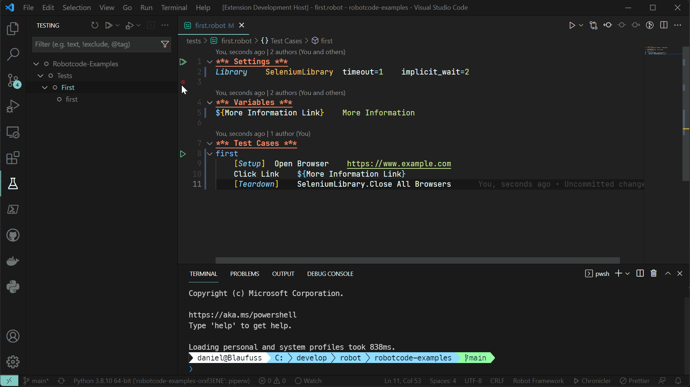

# RobotCode - Language support for Robot Framework for Visual Studio Code

[](https://marketplace.visualstudio.com/items?itemName=d-biehl.robotcode)
[](https://marketplace.visualstudio.com/items?itemName=d-biehl.robotcode)
[](https://github.com/d-biehl/robotcode/actions?query=workflow:build_test_package_publish)
[](https://github.com/d-biehl/robotcode/blob/master/LICENSE)

[](https://pypi.org/project/robotcode)
[](https://pypi.org/project/robotcode)
[](https://pypi.org/project/robotcode/)

----

An [extension](https://marketplace.visualstudio.com/VSCode) which brings support for [RobotFramework](https://robotframework.org/)
to [Visual Studio Code](https://code.visualstudio.com/), including [features](#features) like code completion, debugging, test explorer, refactoring and more!

## Quick start

1. [Install a supported version of Python on your system](https://code.visualstudio.com/docs/python/python-tutorial#_prerequisites)
(note: only Python 3.8 and above are supported)

2. [Install a supported version of RobotFramwork on your system](https://github.com/robotframework/robotframework/blob/master/INSTALL.rst) (note: only RobotFramework 4.0 and above are supported)

3. [Install the RobotCode extension for Visual Studio Code](https://code.visualstudio.com/docs/editor/extension-gallery).
4. Open or create a robot file and start coding! 😉


## Requirements

* Python 3.8 or above
* Robotframework 4.1 and above
* VSCode version 1.74 and above


## Features

With RobotCode you can edit your code with auto-completion, code navigation, syntax checking and many more.
Here is a list of Features:

- [Autocomplete and IntelliSense](#Autocomplete-and-IntelliSense)
- [Code Navigation](#code-navigation)
- [Diagnostics and Linting](#diagnostics-and-linting)
- [Code Formatting](#code-formatting)
- [Running and Debugging](#running-and-debugging)
- [Multi-root Workspace folders](#multi-root-workspace-folders)
- Find implementations and references of keywords, variables, libraries, resource and variable files
  - Show codelenses for keyword definitions
- Test Explorer
- Refactorings
  - renaming keywords, variables, tags

### Autocomplete and IntelliSense

Autocompletion for:
- Libraries with parameters
- Resources,
- Variables
- Keywords with parameters
- Namespaces


Autocompletion supports all supported variables types
  - local variables
  - variables from resource files
  - variables from variables file (.py and .yaml)
    - static and dynamic
  - command line variables
  - builtin variables


### Code Navigation

- Symbols
- Goto definitions and implementations
  - Keywords
  - Variables
  - Libraries
  - Resources
- Find references
  - Keywords
  - Variables
  - Imports
    - Libraries
    - Resources
    - Variables
  - Tags
- Errors and Warnings

### Diagnostics and Linting

RobotCode analyse your code and show diagnostics for:
- Syntax Errors
- Unknown keywords
- Duplicate keywords
- Missing libraries, resource and variable imports
- Duplicate libraries, resource and variable imports
- ... and many more

For most things RobotCode uses the installed RobotFramework version to parse and analyse the code, so you get the same errors as when you run it.


Get additional code analysis with [Robocop](https://robocop.readthedocs.io/). Just install it in your python environment.

### Code Formatting

RobotCode can format your code with the internal RobotFramework robot.tidy tool (deprecated), but also with [Robotidy](https://robotidy.readthedocs.io/). Just install it.

### Running and Debugging

RobotCode supports running and debugging of RobotFramework testcases and tasks out of the box, directly from the definition of the test or suite.



In the debug console you can see all log messages of the current run and navigate to the keyword the message was written by.

### Multi-root Workspace folders

RobotCodes support for [Multi-root Workspaces](https://code.visualstudio.com/docs/editor/multi-root-workspaces), enables loading and editing different Robotframework projects/folders with different RobotFramework/Python environments and settings at the same time or you can share the same RobotFramework/Python environment and settings for all folders in the workspace.


## Installed extensions

RobotCode will automatically install [Python extension](https://marketplace.visualstudio.com/items?itemName=ms-python.python).

Extensions installed through the marketplace are subject to the [Marketplace Terms of Use](https://cdn.vsassets.io/v/M146_20190123.39/_content/Microsoft-Visual-Studio-Marketplace-Terms-of-Use.pdf).


## Setting up your environment

You can alway use your local python environment, just select the correct python interpreter in Visual Studio Code.

### With pipenv

This is the simpliest way to create an running environment.

- As a prerequisite you need to install [pipenv](https://pipenv.pypa.io/) like this:

    ```bash
    python -m pip install pipenv
    ```


- Create your project directory (robottest is just an example)
    ```bash
    mkdir robottest
    cd robottest
    ```
- Install robotframework
    ```bash
    python -m pipenv install robotframework
    ```
- Open project in VSCode
- Set the python interpreter to the created virtual environment


## Customization

### Editor Style

You can change some stylings for RobotFramework files in VSCode editor, independently of the current theme. (see [Customizing a Color Theme](https://code.visualstudio.com/docs/getstarted/themes#_customizing-a-color-theme))

See the difference:

| Before                                                           | After                                                      |
| ---------------------------------------------------------------- | ---------------------------------------------------------- |
|  |  |


As a template you can put the following code to your user settings of VSCode.

Open the user `settings.json` like this:

<kbd>Ctrl</kbd> + <kbd>Shift</kbd> + <kbd>P</kbd> or <kbd>F1</kbd> or <kbd>CMD</kbd> + <kbd>Shift</kbd> + <kbd>P</kbd>

and then type:

`Preferences: Open Settings (JSON)`

put this to the `settings.json`

```jsonc
"editor.tokenColorCustomizations": {
    "textMateRules": [
        {
            "scope": "variable.function.keyword-call.inner.robotframework",
            "settings": {
                "fontStyle": "italic"
            }
        },
        {
            "scope": "variable.function.keyword-call.robotframework",
            "settings": {
                //"fontStyle": "bold"
            }
        },
        {
            "scope": "string.unquoted.embeddedArgument.robotframework",
            "settings": {
                "fontStyle": "italic"
            }
        },
        {
            "scope": "entity.name.function.testcase.name.robotframework",
            "settings": {
                "fontStyle": "bold underline"
            }
        },
        {
            "scope": "entity.name.function.keyword.name.robotframework",
            "settings": {
                "fontStyle": "bold italic"
            }
        },
        {
            "scope": "variable.other.readwrite.robotframework",
            "settings": {
                //"fontStyle": "italic",
            }
        },
        {
            "scope": "keyword.control.import.robotframework",
            "settings": {
                "fontStyle": "italic"
            }
        },
        {
            "scope": "keyword.other.header.setting.robotframework",
            "settings": {
                "fontStyle": "bold underline"
            }
        },
        {
            "scope": "keyword.other.header.variable.robotframework",
            "settings": {
                "fontStyle": "bold underline"
            }
        },
        {
            "scope": "keyword.other.header.testcase.robotframework",
            "settings": {
                "fontStyle": "bold underline"
            }
        },
        {
            "scope": "keyword.other.header.keyword.robotframework",
            "settings": {
                "fontStyle": "bold underline"
            }
        },
        {
            "scope": "keyword.other.header.setting.robotframework",
            "settings": {
                "fontStyle": "bold underline"
            }
        },
        {
            "scope": "keyword.other.header.comment.robotframework",
            "settings": {
                "fontStyle": "bold italic underline"
            }
        },
        {
            "scope": "string.unquoted.escape.robotframework",
            "settings": {
                //"foreground": "#FF0000",
            }
        }
    ]
},

"editor.semanticTokenColorCustomizations": {
    "rules": {
        "*.documentation:robotframework": {
            "fontStyle": "italic",
            //"foreground": "#aaaaaa"
        }
    }
}

```
