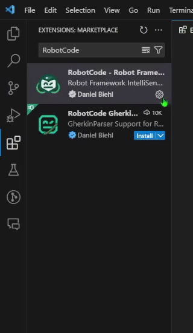

# Let's get started!!!

Let's explore how you can enhance your development experience with RobotCode - Robot Framework for Visual Studio Code. We'll walk you through the steps of installing the RobotCode extension, configuring your environment, and ensuring smooth functionality. Get ready to unleash the power of RobotCode and Robot Framework in no time!


## Requirements

- Python 3.8 or above
- Robotframework version 4.1 and above
- VSCode version 1.86 and above

## Installing RobotCode

To install RobotCode and set up your Robot Framework project in Visual Studio Code, follow these steps:

1. Open Visual Studio Code.
2. Go to the **Extensions** tab by pressing [[CONTROL+SHIFT+X]] or [[COMMAND+SHIFT+X]] on Mac
3. Search for **RobotCode** and install the [RobotCode - Robot Framework Support](https://marketplace.visualstudio.com/items?itemName=d-biehl.robotcode) extension. This will also install the **Python** and **Python Debugger** extensions.
4. *(Recommended)* Install the **Even Better TOML** extension for better handling of `.toml` files, which will be useful when configuring your project settings in the [Configuration](./configuration) section.


::: details Tip: Add to Workspace Recommendations (Optional)

To ensure a consistent development environment for everyone working on this project, follow these steps:

1. Right-click on the RobotCode extension in the Extensions tab.
2. Click on **Add to Workspace Recommendations**. This will prompt all team members to install the RobotCode extension, creating a unified development environment.



:::

See also the VSCode Documention on how to work with extensions [here](https://code.visualstudio.com/docs/editor/extension-marketplace).


## Setup a Robot Framework Project

First you need to open your project folder in Visual Studio Code. You can do this by selecting **File > Open Folder** menu and navigating to the root folder of your project. If you don't have a project folder yet, you can also create a new folder in the "Open Folder" dialog.

It is a good style to manage your project dependencies in a `requirements.txt` file. This file lists all the Python packages required for your project, including Robot Framework and any other dependencies you may need. This file can be used to install all the dependencies at once, ensuring that your project runs consistently across different environments.

::: tip Note
However, it's important to note that there are alternative and better methods for setting up a Robot Framework project. Tools like [Hatch](https://hatch.pypa.io/) or [Poetry](https://python-poetry.org/)  offer additional features and flexibility for managing project dependencies and environments.
:::

Create a `requirements.txt` file in the root folder of your project and add the following content:

```requirements.txt [requirements.txt]
robotframework
```

If you require additional dependencies, you can include them in the `requirements.txt` file. For instance, if you wish to utilize [robotframework-tidy](https://github.com/MarketSquare/robotframework-tidy) for formatting your robot files and the [Browser library](https://robotframework-browser.org/) for website testing, you can add the following line to the `requirements.txt` file:

```requirements.txt [requirements.txt]
robotframework
robotframework-tidy
robotframework-browser
```

### Installing Dependencies

::: warning
Depending on your requirements and system environment, it is advisable to avoid using the system python interpreter for development. Utilizing the system python interpreter can potentially cause conflicts with other projects or system dependencies. Instead, it is recommended to create a virtual environment for your project. Please refer to the [Creating a Virtual Python Environment](#creating-a-virtual-python-environment) section for detailed instructions.

However, there are scenarios where using the system python interpreter is acceptable, such as when working with a docker container or a CI/CD pipeline. In such cases, you can skip the virtual environment setup and directly install the dependencies to the system python interpreter.

If you want to use a virtual environment, please continue with the [Creating a Virtual Python Environment](#creating-a-virtual-python-environment) section.
:::

To install the dependencies listed in the `requirements.txt` file, open the terminal in Visual Studio Code and run the following command:

```shell
pip install -r requirements.txt
```

This command will install the Robot Framework and any other dependencies listed in the `requirements.txt` file. Make sure to run this command in the root folder of your project.


#### Creating a Virtual Python Environment

It is recommended to use a virtual python environment for your project to manage dependencies and ensure consistency across different environments. A virtual environment allows you to isolate your project's dependencies from the system-wide Python installation, ensuring that your project runs consistently across different environments.

::: details What is a Virtual Python Environment?

A virtual environment is a self-contained directory that contains a Python installation along with all the necessary packages and dependencies for a specific project.

Using a virtual environment is beneficial for several reasons:
- Dependency management: By creating a virtual environment, you can easily manage and install project-specific dependencies without affecting other Python projects or the system-wide Python installation.
- Version control: Including the virtual environment directory in your project's version control system ensures that all developers working on the project have the same environment setup, avoiding compatibility issues.
- Reproducibility: With a virtual environment, you can recreate the exact environment in which your project was developed, making it easier to reproduce and debug issues.

More informations about virtual environments can be found in the [Python documentation](https://docs.python.org/3/library/venv.html).

:::

There are several ways to create a virtual Python environment and managing you project and project dependencies, depending on your preference and workflow. Below, we use the standard builtin python methods and describe two ways for creating a virtual environment: the "VSCode way" and the "Python way".
Some other good options to manage your Robot Framework/Python environment are [hatch](https://hatch.pypa.io/), [poetry](https://python-poetry.org/) or [pipenv](https://pipenv.pypa.io/en/latest/)

:::tabs
=== The VSCode way

VSCode provides a built-in feature to create a virtual environment for your Robot Framework/ Python project. This feature allows you to create a virtual environment and install dependencies directly from the editor. You can also specify the Python version and include one or more `requirements.txt` files for managing project dependencies.

You can refer to the [Python environments in VSCode Documentation](https://code.visualstudio.com/docs/python/environments) for more information.

The short version of the steps are:

1. Open the Command Palette by pressing
   [[CONTROL+SHIFT+P]] or [[COMMAND+SHIFT+P]] on Mac, then search for `Python: Create Environment`, and select it.
2. Choose `Venv`, this will create a virtual environment in the `.venv` folder in your project.
3. Select your preferred Python version.
4. Check the box for requirements.txt and click OK.


=== The Python way

To create a virtual environment in Python, you can use the built-in `venv` module. This module provides a command-line interface as well as a Python API for managing virtual environments.

Open a Terminal in VSCode and ensure you are in the root folder of your project. Then follow these steps:

1. Create a virtual environment:
    ```
    python -m venv .venv
    ```

2. Activate the virtual environment:
    ::: code-group
    ``` shell [Windows PowerShell/pwsh]
    myenv\Scripts\activate.ps1
    ```

    ``` shell [Windows CMD]
    myenv\Scripts\activate.cmd
    ```

    ``` shell [Mac/Linux]
    source myenv/bin/activate
    ```
    :::

3. Install project-specific dependencies:
    ```
    pip install -r requirements.txt
    ```
:::


::: tip
Remember to include the virtual environment directory `.venv` in your project's `.gitignore` file to avoid committing unnecessary files to your version control system.
"""
:::

## Selecting the Python Interpreter

After creating a virtual environment or if you want to switch to a different Python interpreter with Robot Framework installed for your project, you can select the Python interpreter in Visual Studio Code. This ensures that the correct Python environment is used for running your Robot Framework tests.

To select the Python interpreter, follow these steps:

1. Open the Command Palette by pressing [[CONTROL+SHIFT+P]] or [[COMMAND+SHIFT+P]] on Mac.
2. Search for `Python: Select Interpreter` and select it.
3. Choose the Python interpreter associated with your virtual environment or the Python interpreter with Robot Framework installed.


## Verifying the Installation

1. Open the terminal in Visual Studio Code. You can do this by pressing [[CONTROL+`]] or selecting **Terminal > New Terminal** from the menu. If there is an existing terminal, you can close it and open a new one to ensure that the virtual environment is activated.
2. Run the command `robot --version` to check if Robot Framework is installed correctly.

If the command returns the Robot Framework version number, your installation is successful!
If you encounter any errors, ensure that your virtual environment is activated and that all dependencies in `requirements.txt` have been installed.

## Create and Run Your First Suite/Test

Create a `first.robot` file in your project with the following code to demonstrate a basic example of logging a string message to the debug console:


```robot [first.robot]
*** Test Cases ***
First Test Case
    Log    Hello world

```


To run this test file, press the green play button next to the `First Test Case` keyword in the code.
You should see the `Hello world` output displayed in the **Debug Console** of Visual Studio Code.


And that's it! If you have any questions or run into issues, check out the RobotCode documentation or join our community in slack for support. Happy coding!
