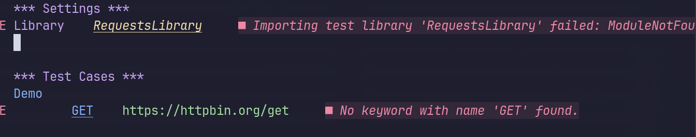

# Configuring RobotCode as Language Server for Neovim

[Neovim](https://neovim.io/) is an extensible Vim-based text editor.
While there is no fully featured plugin of RobotCode that you can just install
and use "as is" like for VS Code, it is still possible to leverage the
[Language Server](https://microsoft.github.io/language-server-protocol/)
provided by RobotCode to enable static analysis, go-to-definition, and other
useful features.

This guide shows two alternatives to set up and configure your Neovim
installation to use the RobotCode language server properly.

## Common Prerequisites

To follow this guide, the reader is expected to already know the basics of

* installing and configuring Neovim
* adding plugins to Neovim
* Python virtual environments and how to create them

Regardless of the option you choose, using a language server in Neovim
always requires to

* **install** the language server
* **configure** the language server
* **enable** the language server

This guide assumes a Neovim version >= 0.11 and uses the built-in LSP API.

## The Common Pitfall When Using Mason and nvim-lspconfig

Two plugins are commonly used to install and configure LSP servers for Neovim,
and are included in Neovim starter distributions like [LazyVim](https://www.lazyvim.org/):

* [mason.nvim](https://github.com/mason-org/mason.nvim):
  a package manager that lets you install and manage LSP servers, including RobotCode
* [nvim-lspconfig](https://github.com/neovim/nvim-lspconfig):
  quickstart configurations for LSP servers, including a configuration for RobotCode

While this combination sounds ideal, you will quickly experience import errors for
third party libraries and custom keywords. Understanding why this happens is important
to understand the differences of the alternatives discussed below.



`Mason` installs every package in a dedicated virtual environment, and makes the
corresponding binary available globally from within Neovim.

`nvim-lspconfig` provides the following configuration:

```lua
return {
  cmd = { 'robotcode', 'language-server' },  -- [!code focus]
  filetypes = { 'robot', 'resource' },
  root_markers = { 'robot.toml', 'pyproject.toml', 'Pipfile', '.git' },
  get_language_id = function(_, _)
    return 'robotframework'
  end,
}
```

This will start the language server by using the first `robotcode` binary found
in `PATH`, which most likely is the one installed via `Mason`.

In this situation, RobotCode can only "see" the packages that are available in the
virtual environment created by `Mason`, lacking all third party keyword libraries
you may have installed in your project's virtual environment.

## Setup Alternatives

### Option 1: Use Local Installation of RobotCode

The easiest way to run RobotCode in the context of your project's virtual environment
is to add `robotcode[languageserver]` (or simply `robotcode[all]`) to your dependencies.

To configure the RobotCode language server, install `nvim-lspconfig`, or create
the file manually under `~/.config/nvim/lsp/robotcode.lua`:

```lua
---@brief
---
--- https://robotcode.io
---
--- RobotCode - Language Server Protocol implementation for Robot Framework.
return {
  cmd = { 'robotcode', 'language-server' },
  filetypes = { 'robot', 'resource' },
  root_markers = { 'robot.toml', 'pyproject.toml', 'Pipfile', '.git' },
  get_language_id = function(_, _)
    return 'robotframework'
  end,
}
```

Enable the LSP server by adding the following line to `~/.config/nvim/init.lua`:

```lua
vim.lsp.enable("robotcode")
```

Before starting Neovim, make sure to first activate the virtual environment.
If your virtual environment is created in the folder `.venv`:

::: code-group

``` shell [Mac/Linux]
source .venv/bin/activate
nvim
```

``` ps [Windows PowerShell/pwsh]
.venv\Scripts\activate.ps1
nvim
```

``` cmd [Windows CMD]
.venv\Scripts\activate.cmd
nvim
```

:::

This ensures the `robotcode` binary from your project's environment is the first
in `PATH`.

### Option 2: Use Globally Installed RobotCode and Set PYTHONPATH

With this approach it is not necessary to install RobotCode in each and
every project.
You use `Mason` to install and update RobotCode globally for Neovim. The LSP configuration
provides a helper function to set the PYTHONPATH variable so the globally installed
RobotCode can import all your project specific libraries.

First, install RobotCode by executing `:MasonInstall robotcode` from within
Neovim, or by using the `Mason` UI (`:Mason`).

Next, create the LSP configuration under
`~/.config/nvim/lsp/robotcode.lua`:

```lua
---@brief
---
--- https://robotcode.io
---
--- RobotCode - Language Server Protocol implementation for Robot Framework.
local function get_python_path()
 local project_site_packages = vim.fn.glob(vim.loop.cwd() .. "/.venv/lib/python*/site-packages", true, true)[1]
 local pythonpath = project_site_packages
 if vim.env.PYTHONPATH then
  pythonpath = project_site_packages .. ":" .. vim.env.PYTHONPATH
 end
 return pythonpath
end

---@type vim.lsp.Config
return {
 cmd = { 'robotcode', 'language-server' },
 cmd_env = {
  PYTHONPATH = get_python_path(),
 },
 filetypes = { 'robot', 'resource' },
 root_markers = { 'robot.toml', 'pyproject.toml', 'Pipfile', '.git' },
 get_language_id = function(_, _)
  return 'robotframework'
 end,
}
```

Note that `get_python_path` assumes that your virtual environment is created
inside your project folder in a folder called `.venv`, which is a
widespread standard but not necessarily true for some tools (e.g. `pyenv`).

Finally, enable the LSP server in `~/.config/nvim/init.lua`:

```lua
vim.lsp.enable("robotcode")
```

This solution also works if you have some projects that have RobotCode installed
locally. The downside is that you may have to tweak `get_python_path` if you don't
follow the `.venv` folder convention.

## Final Notes

Be aware that this setup only enables the features provided by the language server,
i.e. diagnostics, completions, go-to-definition etc.
Unlike the VS Code plugin this setup does not enable you to run or debug robot tests
from within Neovim.
