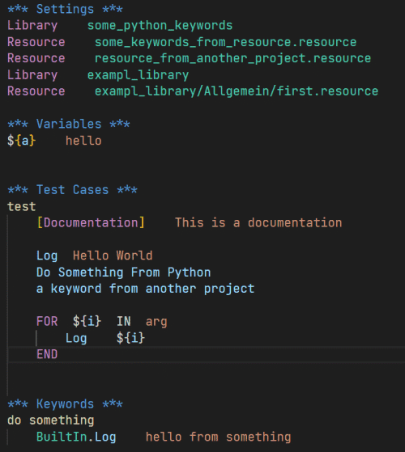
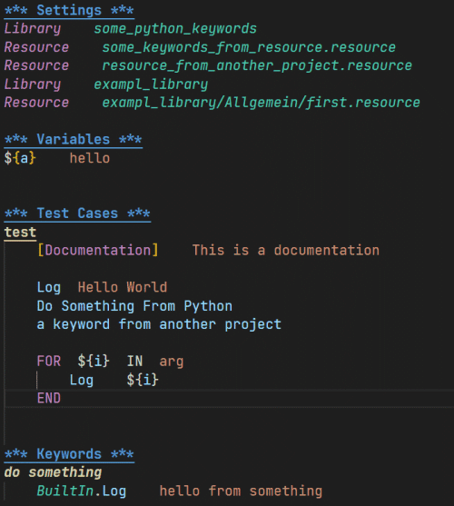

# Customizing Visual Studio Code for using RobotCode

This guide helps you customize VSCode to improve your experience when working with RobotCode.

## Editor Style

You can change how Robot Framework files appear in the VSCode editor, independently of your current theme. These customizations can make your code more readable by highlighting different elements.

See the difference:

| Before                                                            | After                                                       |
| ----------------------------------------------------------------- | ----------------------------------------------------------- |
|  |  |

### How to Apply Customizations

1. Open your VSCode user settings:
   - Press <kbd>Ctrl</kbd> + <kbd>Shift</kbd> + <kbd>P</kbd> (Windows/Linux) or <kbd>CMD</kbd> + <kbd>Shift</kbd> + <kbd>P</kbd> (Mac)
   - Type: `Preferences: Open Settings (JSON)`

2. Add the following code to your `settings.json` file:

```jsonc
"editor.tokenColorCustomizations": {
    "textMateRules": [
        {
            "scope": "variable.function.keyword-call.inner.robotframework",
            "settings": {
                "fontStyle": "italic"
            }
        },
        {
            "scope": "variable.function.keyword-call.robotframework",
            "settings": {
                //"fontStyle": "bold"
            }
        },
        {
            "scope": "string.unquoted.embeddedArgument.robotframework",
            "settings": {
                "fontStyle": "italic"
            }
        },
        {
            "scope": "entity.name.function.testcase.name.robotframework",
            "settings": {
                "fontStyle": "bold underline"
            }
        },
        {
            "scope": "entity.name.function.keyword.name.robotframework",
            "settings": {
                "fontStyle": "bold italic"
            }
        },
        {
            "scope": "variable.name.readwrite.robotframework",
            "settings": {
                //"fontStyle": "italic",
            }
        },
        {
            "scope": "keyword.control.import.robotframework",
            "settings": {
                "fontStyle": "italic"
            }
        },
        {
            "scope": "keyword.other.header.setting.robotframework",
            "settings": {
                "fontStyle": "bold underline"
            }
        },
        {
            "scope": "keyword.other.header.variable.robotframework",
            "settings": {
                "fontStyle": "bold underline"
            }
        },
        {
            "scope": "keyword.other.header.testcase.robotframework",
            "settings": {
                "fontStyle": "bold underline"
            }
        },
        {
            "scope": "keyword.other.header.keyword.robotframework",
            "settings": {
                "fontStyle": "bold underline"
            }
        },
        {
            "scope": "keyword.other.header.setting.robotframework",
            "settings": {
                "fontStyle": "bold underline"
            }
        },
        {
            "scope": "keyword.other.header.comment.robotframework",
            "settings": {
                "fontStyle": "bold italic underline"
            }
        },
        {
            "scope": "string.unquoted.escape.robotframework",
            "settings": {
                //"foreground": "#FF0000",
            }
        }
    ]
},

"editor.semanticTokenColorCustomizations": {
    "rules": {
        "*.documentation:robotframework": {
            "fontStyle": "italic",
            //"foreground": "#aaaaaa"
        }
    }
}

```
